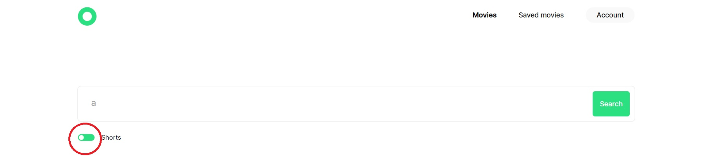

# Movies Browser - work example of Sergey Kharkovshchenko

## Decription

Movies Browser is a service, that allows to find a movie by request and to save it in your personal account.

## Functionality

- available on mobile devices,
- all interactive elements have animation,
- user registration and authorization,
- the type of the header changes depending on the authorization,
- the user receives a message in case of any error,
- when searching, the query text, found movies and the state of the shorts switcher are saved in the storage,
- form fields are blocked while sending requests, and the user is not able to send a new request until the previous one is completed,
- all forms are validated on the client side, the user cannot send a request with invalid data,
- editing profile (name, email),
- the user is shown a notification about a successful request to the server when saving the profile,
- if the information entered on the profile editing page corresponds to the current user data, the "Save" button is disabled and it is not possible to send a save request,
- the preloader is spinning while the movie request is being executed,
- if the cards have already been displayed on the page in the results block, clicking on the checkbox "Short films" leads to the re-filtering of the result

- for optimization, the request to get all movies is executed only once, after which they are saved in local storage,
- the grid of movies depends on the width of the screen. When you click on the "More" button, as many films as there are currently displayed in one row (3, 2 or 5) will be displayed. 

- save/delete movies. When changing pages, the current data is displayed. On the "Saved" page, you can only delete
- when you click on a movie poster in a new tab, it opens the trailer (if any),
- when you try to go to any protected route, a redirect to the main one occurs, 
- if the user was authorized and closed the tab, he can immediately return to any page of the application at the URL, except for the authorization and registration pages,
- when you try to go to a non-existent page, a redirect to the "404" page occurs.

## Technologies

- React
- React Router
- Hooks (useState, useEffect, useContext)
- custom hooks (validation, screen width checking)
- local storage and cookies
- asynch API
- HOC-components
- BEM
- Git handling
- authorization
-  responsive/adaptive

## Instruction

Few simple steps to run this project.

- Create a folder and go in this folder:

```
cd <Folder name>
```

- Clone this rep:

```
git clone https://github.com/SergeyKharkovshchenko/movies-explorer-frontend
```

- Install dependencies:

```
npm install
```

- Run a project:

```
npm start
```

## Node version

Node.js v18.13.0

## Git of backend:
https://github.com/SergeyKharkovshchenko/movies-explorer-api


## Link to a web site:
http://sergey-kh.dilpom.nomoredomainsclub.ru/


